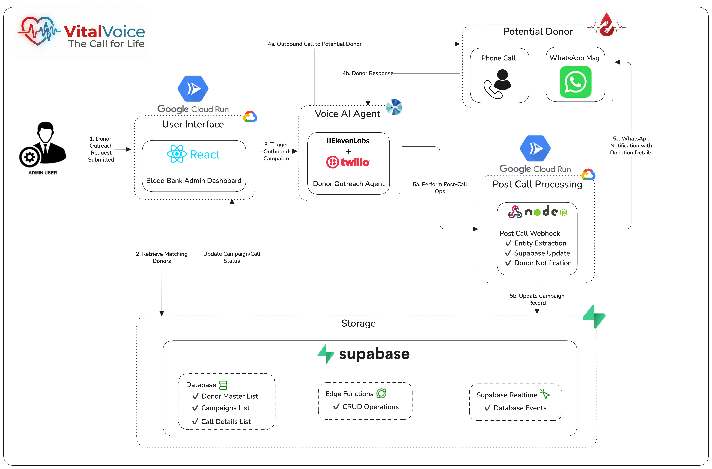

# VitalVoice Realtime

Lightweight realtime proxy and web client for ElevenLabs ConvAI — designed for live conversational agents with an admin dashboard and basic location/distance utilities (Google Maps).


## Features

- Proxy between web clients and ElevenLabs conversational WebSocket API
- Admin dashboard that receives session snapshots and live event streams
- Client React app with an `/admin` route for monitoring
- Simple map and distance endpoints backed by Google Maps

## Architecture


## Repo Layout

- `server/` — Node/Express WebSocket proxy and API (`index.js`)
- `client/` — Vite + React frontend (`src/`), admin dashboard and main UI
- `App-Deployment.MD` — deployment notes
- `LICENSE` — project license

## Prerequisites

- Node.js (18+ recommended)
- npm or yarn
- ElevenLabs API key and (optionally) an ElevenLabs agent id
- Google Maps API key (for `/api/distance` and map config)

## Environment Variables

Create a `.env` file in the `server/` directory or provide env vars to your process with these keys:

- `ELEVENLABS_API_KEY` — required to connect to ElevenLabs WebSocket
- `ELEVENLABS_AGENT_ID` — optional default agent id for some endpoints
- `GOOGLE_MAPS_API_KEY` — required for distance calculations
- `HOSPITAL_LOCATION` — origin address used by the server's distance API
- `PORT` — optional, default `3000`

A template file is provided at `server/.env.example`. Copy it to `server/.env` and fill in your keys before starting the server.

## Installation

Install server dependencies:

```bash
cd server
npm install
```

Install client dependencies:

```bash
cd client
npm install
```

## Running Locally (development)

Start the server (auto-restarts with nodemon if you use `dev`):

```bash
cd server
npm run dev   # uses nodemon
# or: npm start
```

Start the client (Vite dev server on port 5174):

```bash
cd client
npm run dev
```

Open the app in the browser at `http://localhost:5174`. To view the admin dashboard, navigate to `http://localhost:5174/#admin`.

## WebSocket Endpoints

- Admin: `ws://<server>:<PORT>/ws-admin` — connects an admin UI to receive snapshots and live events.
- Monitor (optional): `ws://<server>:<PORT>/ws-monitor?conversation_id=<id>` — triggers monitoring for a conversation.
- Agent / Client: `ws://<server>:<PORT>/?agent_id=<AGENT_ID>` or `ws://<server>:<PORT>/ws-proxy?agent_id=<AGENT_ID>` — client connects and the server proxies to ElevenLabs.

The server forwards messages between the web client and the ElevenLabs conversation WebSocket. The server also buffers client messages until the upstream ElevenLabs connection is initialized and sends a mandatory initiation metadata payload describing `dynamic_variables` used by the conversation.

## HTTP API

- `GET /api/map-config` — returns `hospitalLocation`, `apiKey` (maps), and `agentId` (from env)
- `GET /api/distance?destination=<address>` — returns distance and duration between `HOSPITAL_LOCATION` and `destination` using Google Maps Distance Matrix API

## Build / Production

Build the client for production and serve the static files with your preferred static hosting or behind the same server:

```bash
cd client
npm run build
# To preview the build locally
npm run preview
```

When deploying the server, ensure all required environment variables are set and do not commit secrets. Use an HTTPS endpoint and a reverse proxy (nginx, cloud load balancer) if exposing the WebSocket endpoints publicly.

## Important Notes

- The server logs some payloads for debugging — avoid sending sensitive data in plain logs.
- The code expects to pass ElevenLabs API key in WebSocket headers; keep keys secure.
- The `server/index.js` file includes a `startMonitoring` call path; ensure any required monitoring helpers are implemented if you extend that functionality.

## Contributing

Feel free to open issues or PRs. Keep changes small and focused. Run the app locally and verify the admin and client routes before submitting.

## License

MIT
